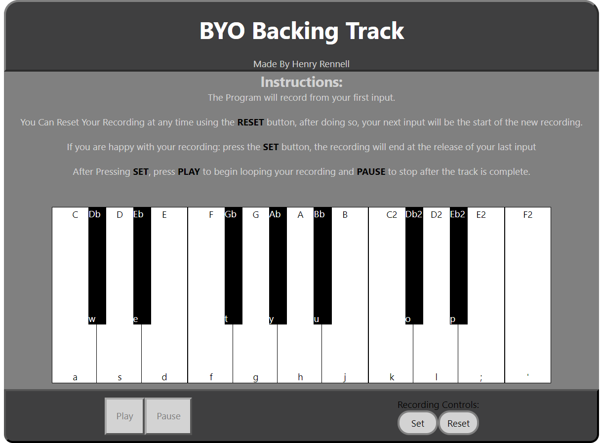

# BYO Backing Track
## Created By Henry Rennell

### check the project out:
[Link](https://henry-rennell.github.io/byo-backing-track/)

## The Idea

My idea came from scouring the internet for backing tracks to improvise over, being a natural control freak, I wasn't satisfied with the results, excellent musically (most), however I wanted to use my own chords, my own progressions and my own BPM. Thus BYO Backing Track was born

By creating what is essentially a looper, I hope to be able to create a tool for musicians to quickly make simple backing tracks within the browser for their practise/improvisation or even for writing instrument parts or vocal melodies over.

## The Technology

This app was built using JavaScript Technology Reactjs, With no external Libraries. 

Essentially this program records your keystrokes, once a recording is set and the user presses Play, the playback function will recreate your assign your keystrokes to their corresponding position on the keyboard and loop.

The idea behind creating this Pseudo-MIDI format was rooted in the idea of the ability to easly change the instrument your inputs are played through. 

also just for fun.

## Future Goals For the Project
- Add more instruments
- Add pitch shift
- Add a Metronome